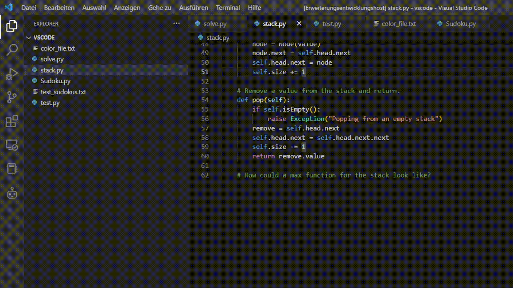

# codex-model-integration README

This extension implements a simple integration for the openai codex model. Please make sure you have set your api-key from openai correctly in your environment variables! You might need to restart VSCode after setting the key! See https://help.openai.com/en/articles/5112595-best-practices-for-api-key-safety for more instructions on how to set the key. 

## Features

To generate text from codex, first select some text or place the cursor. Then click on the little robot icon on the left sidebar and click on the "chatbot" or "continue writing" button. The "chatbot" button uses a simple preprompt that allows for better question answering. The "continue writing" button will just call the raw model on the selected text. You can also define a custom preprompt.

For example if there is an image subfolder under your extension project workspace:

You can also scrape from the web to get additional information from stack overflow about you problem.

## Requirements

Please make sure you have set your api-key from openai correctly in your environment variables! See https://help.openai.com/en/articles/5112595-best-practices-for-api-key-safety for more instructions on how to set the key. 